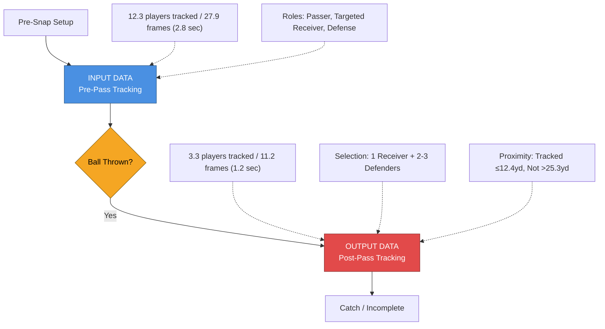

# Charts and Visualizations

This document contains various charts and visualizations for the NFL Big Data Bowl 2026 project.

---

## Dataset Structure and Data Flow

This flowchart illustrates how the competition dataset captures NFL pass play execution across two distinct temporal phases: pre-pass tracking (INPUT) and post-pass tracking (OUTPUT). It shows the systematic player reduction from 12.3 to 3.3 tracked players based on proximity to the ball landing location.



**Key Insights:**
- The dataset isolates the contest for the ball by tracking only players positioned to impact the catch outcome
- Selection is proximity-based: tracked players average 12.4 yards from ball landing vs 25.3 yards for non-tracked players (p < 0.001)
- This structure enables precise measurement of execution quality during the critical 1.2-second window when passes are contested

---

```
flowchart TD
    subgraph INPUT["📥 Data Input"]
        A1[("input_w01-18.csv<br/>Pre-Throw Tracking")]
        A2[("output_w01-18.csv<br/>Post-Throw Tracking")]
        A3[("supplementary_data.csv<br/>Play Context")]
    end

    subgraph PIPELINE["⚙️ Processing Pipeline"]
        B["1️⃣ DataLoader<br/>Stream weeks, validate schemas"]
        C["2️⃣ DataPreProcessor<br/>Stitch frames, normalize coords,<br/>filter zone plays"]
        D["3️⃣ PhysicsEngine<br/>Derive speed & acceleration<br/>(Savitzky-Golay)"]
        E["4️⃣ ContextEngine<br/><b>Phase A:</b> Calculate S_throw<br/>(separation at throw)"]
        F["5️⃣ EraserEngine<br/><b>Phase B:</b> Calculate VIS<br/>(yards closed during flight)"]
        G["6️⃣ BenchmarkingEngine<br/><b>Phase C:</b> Calculate CEOE<br/>(vs. positional benchmarks)"]
    end

    subgraph OUTPUT["📤 Output"]
        H1[("eraser_analysis_summary.csv<br/>Player-level metrics")]
        H2[("master_animation_data.csv<br/>Frame-level data")]
    end

    subgraph ANALYSIS["📊 Analysis Layer"]
        I["TableGenerator<br/>Leaderboards, Quadrants,<br/>EPA/YAC Validation"]
        J["StoryVisualEngine<br/>Landscape, Race Charts,<br/>Heatmaps, Impact Charts"]
        K["AnimationEngine<br/>Play GIFs"]
    end

    A1 --> B
    A2 --> B
    A3 --> B
    B --> C
    C --> D
    D --> E
    E --> F
    F --> G
    G --> H1
    G --> H2
    H1 --> I
    H1 --> J
    H2 --> J
    H2 --> K

    style E fill:#e8f5e9,stroke:#2e7d32,stroke-width:2px
    style F fill:#e3f2fd,stroke:#1565c0,stroke-width:2px
    style G fill:#fff3e0,stroke:#ef6c00,stroke-width:2px
```